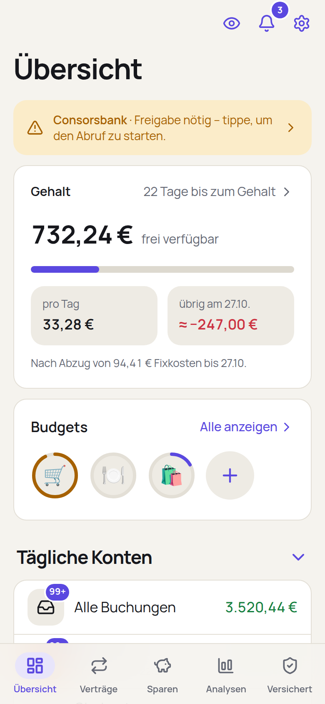
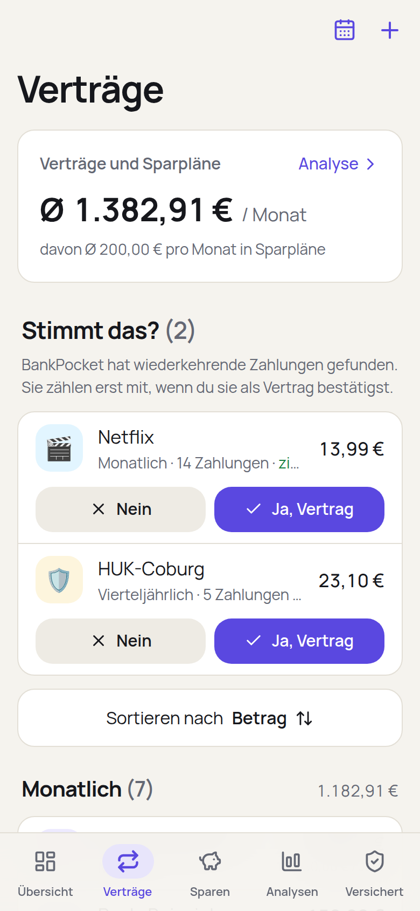
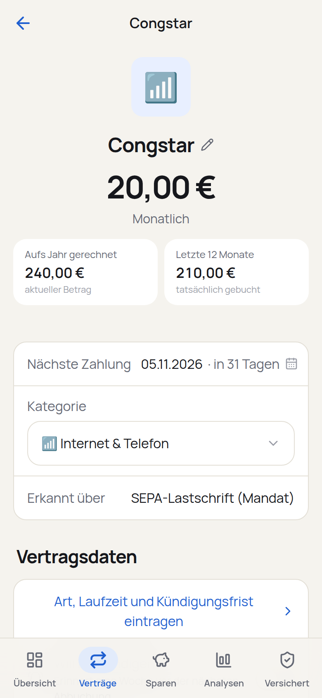
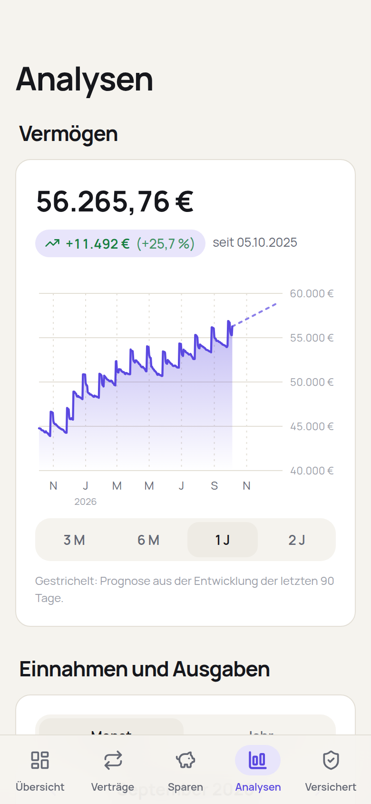
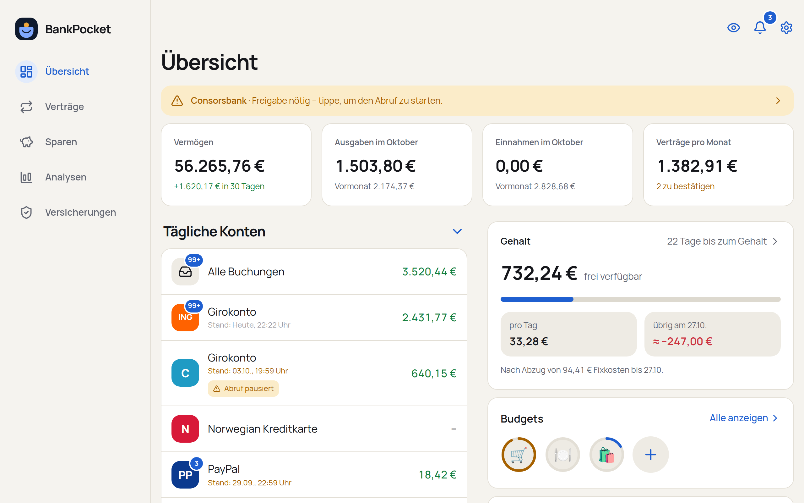

# BankPocket

*[Deutsch](README.md) · English*

Self-hosted personal finance tracker: accounts, contracts, budgets and analytics – entirely on your own server.
Your banking data stays with you: BankPocket fetches transactions directly from your banks and stores them locally
only.

> **Status and liability:** BankPocket is a private project that comes without any warranty and is not affiliated
> with any of the banks or services mentioned. It is read-only – it cannot initiate transfers. In daily use with
> ING (Germany), Consorsbank, Trade Republic, Bank Norwegian and Binance; other FinTS banks (Sparkassen,
> Volksbanken, DKB, comdirect …) use the same path but have not been tested individually. Feedback is welcome.

> **Language:** The app itself is in German only, and it is built around German banks (FinTS). This page is a
> translation of the German README; menu names are given as they appear in the app.

<p>
  
  
  
  
</p>
<p></p>

The screenshots show the bundled demo data (all made up).

- **Automatic bank sync** via FinTS (ING, Consorsbank, Sparkassen, Volks- and Raiffeisenbanken, DKB, comdirect
  and around 2,000 more German banks), four times a day
- **Approval in your banking app** (ING app, SecurePlus app) – confirm once roughly every 90 days
- **Trade Republic** (cash account + portfolio with gain/loss since purchase and value history per position),
  **Bank Norwegian** (credit card via Enable Banking), **Binance** (crypto in euros) and **Splitwise**
- **Budgets** per category with a warning at 80 % and a projection to the end of the month
- **Overview** with account groups, balances, total and **“available from your salary”**: detects when your
  salary arrives (fixed day or e.g. last banking day, with weekends and public holidays), shows what is left per
  day, which fixed costs are still due and what will probably remain at the end
- **Contracts & subscriptions** are detected automatically (SEPA mandates, recurring payments, PayPal merchants,
  savings plans – weekly to yearly) and presented for confirmation; only confirmed contracts count. Plus warnings
  for price increases and overdue payments; your own contracts collect matching transactions
- **Analytics**: net worth over time with forecast, monthly balance, spending by category (pie chart) and by
  tag – every number leads to the transactions behind it
- **Transactions**: search by text, category and tag; per transaction category, tags, note, internal transfer
  and contract assignment; new transactions stay marked until you read them; unclear ones are sorted in bulk
- **Categories** assigned automatically from a large merchant list and the bank's booking text; BankPocket learns
  from your corrections. Optionally **Mistral** (Mistral API) classifies unknown merchants
- **Web app** in a light or dark design: like an app on the phone (with push notifications), a dashboard with
  key figures on the desktop
- **Privacy**: no cloud – PINs are stored encrypted on your server, data is fetched directly from your bank

## Try it first (no bank access needed)

With made-up demo data you can see within a few minutes whether BankPocket is for you. You need Python 3.11+ and
Node.js 20+:

```bash
git clone https://github.com/gurkengraeber/BankPocket.git bankpocket && cd bankpocket
python3 -m venv .venv && .venv/bin/pip install -r requirements.txt
cd frontend && npm ci && npm run build && cd ..
BANKPOCKET_DATA_DIR=demo-daten .venv/bin/python -m bankpocket.demo
BANKPOCKET_DATA_DIR=demo-daten BANKPOCKET_AUTH=aus BANKPOCKET_SCHEDULER=aus \
  .venv/bin/uvicorn bankpocket.main:app --port 8000
```

Then open `http://localhost:8000`. `BANKPOCKET_AUTH=aus` switches the login off – for the demo only.

## 1. Requirements

1. A machine that runs around the clock (home server, Raspberry Pi, NAS with Docker) – easiest is Linux with
   Docker and Docker Compose; check with `bash scripts/check_server.sh`. Without Docker, Python 3.11+ is enough,
   plus Node.js 20+ to build the frontend.
2. For banks via FinTS (ING, Consorsbank, Sparkassen, Volksbanken, DKB …) a **FinTS product ID** from Deutsche
   Kreditwirtschaft: https://www.fints.org/de/hersteller/produktregistrierung
   Registration is free, every installation needs its own ID, and it can take a few days to arrive. Without it,
   banks reject the request – everything else (Trade Republic, Binance, CSV import, manual accounts) works before
   that.
3. Your bank's app on your phone for approvals (ING app, SecurePlus, S-pushTAN …).

## 2. Installation

```bash
git clone https://github.com/gurkengraeber/BankPocket.git bankpocket && cd bankpocket
cp .env.example .env          # enter the product ID, adjust sync times if you like
docker compose up -d --build
docker compose exec -u bankpocket bankpocket python -m bankpocket.passwort   # set the login password
docker compose exec -u bankpocket bankpocket python -m bankpocket.seed       # optional: create cash account etc.
```

Then open it in your home network: `http://<your-server-ip>:8000`

**Important:** Do not set up port forwarding in your router – BankPocket does not belong on the open internet.
For access on the go see section 4 (Tailscale).

**Updating:** `git pull && docker compose up -d --build`. BankPocket adds new database columns itself on start;
before bigger jumps a backup does not hurt (section 6).

### Without Docker

If Docker is not available on the server, BankPocket also runs directly with Python:

```bash
python3 -m venv .venv && .venv/bin/pip install -r requirements.txt
cd frontend && npm install && npm run build && cd ..      # or copy frontend/dist from another machine
cp .env.example .env
set -a; . ./.env; set +a
BANKPOCKET_DATA_DIR=$PWD/data .venv/bin/python -m bankpocket.passwort     # set the login password
umask 077                                                 # database and log readable only by you
BANKPOCKET_DATA_DIR=$PWD/data BANKPOCKET_FRONTEND_DIR=$PWD/frontend/dist \
  .venv/bin/uvicorn bankpocket.main:app --host 0.0.0.0 --port 8000 --workers 1 --proxy-headers
```

Exactly one worker – syncs and the schedule run in the same process. For permanent operation put the last
command into a start script and launch it with `setsid nohup ./start.sh >> bankpocket.log 2>&1 &` (or as a
systemd service).

Updating without Docker: `git pull`, `.venv/bin/pip install -r requirements.txt`, rebuild the frontend
(`cd frontend && npm ci && npm run build`) and restart BankPocket – but not while a sync or a bank login is in
progress.

## 3. Connecting accounts

In the app: **Konto hinzufügen** (add account) → choose a source. On the first sync BankPocket fetches as much
history as the source provides.

| Source | How |
|---|---|
| **ING, Consorsbank** | Enter credentials → confirm in the ING or SecurePlus app if the bank asks. Consorsbank: the login is the account number followed by `001`. Both only return the last 90 days |
| **Sparkasse, Volksbank, DKB & co.** | Search the bank by name, city, BLZ or IBAN → enter credentials → confirm in the banking app (S-pushTAN, SecureGo plus, DKB app …) |
| **Trade Republic** | Phone number with country code (+49 …) + PIN → confirm the login in the Trade Republic app; if two-factor login with an authenticator is set up there, enter the code first, then confirm in the app. Unofficial interface (pytr) – may break when Trade Republic changes something |
| **Bank Norwegian** | Register a free app for “Production” on enablebanking.com, enter the address shown in BankPocket as redirect URL, activate your own account via “Activate by linking accounts”, then paste the application ID and the content of the `.pem` file into BankPocket. Without HTTPS you end up on an error page after approval – copy its address into BankPocket. Approval roughly every 180 days |
| **Binance** | Create a read-only key (Profile → API Management, “Reading” only), paste key + secret |
| **Splitwise** | Without Pro: create it as an account and type in the current balance via “Stand eintragen”. With Splitwise Pro: register an app on secure.splitwise.com/apps and paste the “API key” |

After that everything runs automatically. Roughly every 90 days the bank asks for a new approval – BankPocket
then notifies you by push or with a notice in the app, and you tap **Jetzt freigeben**. When the Trade Republic
session expires, BankPocket deliberately does not request a new one in the background (otherwise the app would
ask at random times) – you get a notice and log in again with one tap.

Transfers between your own accounts (e.g. current account → Trade Republic) do not count as spending. If you
enter your name under *Einstellungen → Umbuchungen*, this also applies to transactions with your name as sender
or recipient – i.e. for accounts of yours that are not connected. Splitwise corrects your spending: if you pay
for others, only your share counts.

Protecting your access: if the bank rejects the PIN, BankPocket stops all automatic attempts until you correct
the credentials in the app – so the bank does not lock your access after three failed attempts.

## 4. HTTPS via Tailscale (for push, app mode and access on the go)

Browsers only allow push notifications and “Add to home screen” over HTTPS. The easiest way is Tailscale:
BankPocket gets its own device `bankpocket` in your tailnet with a real certificate – reachable only from your
own Tailscale devices, at home and on the go. No ports are occupied on the server, nothing is opened in the
router.

Once, in the Tailscale admin console (login.tailscale.com):

1. Enable **DNS → MagicDNS** and **HTTPS Certificates**
2. **Settings → Keys → Generate auth key** (single use is enough), put the key into `.env` as `TS_AUTHKEY`

On the server:

```bash
docker compose --profile tailscale up -d
docker compose logs tailscale | tail    # should show “bankpocket” as logged in
```

3. In the Tailscale admin console, on the device `bankpocket`: **⋯ → Disable key expiry** (otherwise you have to
   log in again every 180 days)
4. Empty `TS_AUTHKEY` in `.env` again – it is no longer needed
5. Install the Tailscale app on your phone and log in, then open `https://bankpocket.<your-tailnet>.ts.net` in
   Chrome (exact address: in the Tailscale app under the device) – the first load takes a few seconds because
   the certificate is fetched
6. Chrome menu → **Add to home screen**, then in BankPocket **Einstellungen → Push aufs Handy → Aktivieren**

If everything runs via Tailscale you can close access in the home network: `BANKPOCKET_PORT=127.0.0.1:8000` in
`.env`.

**Alternative without Tailscale** (home network only): `docker compose --profile https up -d` starts Caddy with
its own certificate authority on `https://<BANKPOCKET_HOST>:8443`. The root certificate
`caddy-daten/caddy/pki/authorities/local/root.crt` then has to be installed once on the phone.

## 5. Categories with AI (optional)

Under **Einstellungen → Kategorien mit KI**, store an API key from console.mistral.ai. After each sync Mistral
then classifies the merchants that no rule recognises – each one only once.

- Only the merchant name and a shortened payment reference are sent – no IBAN, amounts, balances or longer
  numbers. Transfers to private individuals are not sent at all.
- Your rules and your own corrections always take precedence.
- Model: Mistral Small. Cost: a few cents on the first run, usually under 10 cents a month afterwards.

## 6. Backup

Everything important is in `data/`:

| File | Content |
|---|---|
| `bankpocket.db` | Accounts, transactions, contracts, settings |
| `secret.key` | Key for the stored PINs – **without it the PINs cannot be read** |
| `vapid_private.pem` | Key for push notifications |

With Tailscale, also back up `tailscale-daten/` – otherwise `bankpocket` has to log in again.

BankPocket backs up these three files once a day (after the first automatic sync) as one archive to
`data/backups/` – the last 14 days and the first backup of each month, one year back. Status and “Jetzt sichern”
are under *Einstellungen → Sicherung*; if a backup fails, a notice appears.

That alone does not help if the disk fails. For an encrypted off-site copy, in `.env`:

```
BANKPOCKET_BACKUP_PASSWORT=a-long-password
BANKPOCKET_BACKUP_ZIEL=mycloud:Backup/BankPocket
```

The target is an [rclone](https://rclone.org) remote (set it up once with `rclone config`) or a folder, e.g. on
a second disk. Uploads are always encrypted (AES-256); the cloud provider only sees an unreadable file. **The
password belongs in your password manager** – if it only lives on the server, the backup is worthless after a
failure.

Restoring:

```bash
python -m bankpocket.backup entschluesseln bankpocket-2026-10-04.tar.gz.enc   # with the password from .env
# or entirely without BankPocket:
openssl enc -d -aes-256-cbc -pbkdf2 -iter 600000 -md sha256 -in bankpocket-2026-10-04.tar.gz.enc -out backup.tar.gz
tar -xzf backup.tar.gz -C data/     # stop BankPocket first
```

Encrypting the server's disk as well protects you if the server is stolen.

## Security at a glance

- Bank PINs and FinTS session data are encrypted (Fernet/AES), the key is kept separate from the database
- Web app with password (scrypt), session cookie `HttpOnly` + `SameSite=Strict`, throttling after failed logins
- The browser loads scripts only from your own server (Content Security Policy); the database is readable only
  by the user BankPocket runs as
- Without HTTPS, password and session travel unencrypted through the home network – only use it in a Wi-Fi you
  trust
- Push contents are end-to-end encrypted; the FinTS protocol does not end up in the log
- The container runs without root privileges

## Accounts without a bank connection

- **Manual accounts** (cash, deposits & debts, crypto): *Konto hinzufügen → Manuelles Konto*, add transactions
  or enter the current balance (each with a date). Self-entered transactions can be edited and deleted later
- **CSV import** (PayPal, Norwegian, ING and Consorsbank exports): *Konto hinzufügen → Kontoauszug importieren*.
  Column names are detected automatically; more aliases in `bankpocket/csv_import.py`. If the statement contains
  no balance, add it via “Stand eintragen” – only then does the account count towards your net worth
- **Portfolio overview as CSV** (e.g. Consorsbank): same way, as a new account. It becomes a portfolio with all
  positions, purchase prices and gain/loss since purchase

## Features in detail

What is behind the individual pages – contracts, “frei verfügbar”, analytics, savings, insurance, internal
transfers, categories – is described in [docs/FUNKTIONEN.md](docs/FUNKTIONEN.md) (German).

## Troubleshooting

| What you see | What is behind it |
|---|---|
| “Keine FinTS-Produkt-ID eingetragen” | Set `BANKPOCKET_FINTS_PRODUCT_ID` in `.env` and restart BankPocket |
| “Die Bank hat die Anmeldung abgelehnt … Meldung der Bank: 9942 – PIN ungültig” | The bank does not accept the login or PIN. **Do not retry repeatedly** – banks lock the access after three failed attempts. Log in on the bank's website first, then re-enter the credentials in BankPocket. Consorsbank: the login is the account number followed by `001` |
| Another “Meldung der Bank” (message from the bank) | Error number and text come straight from the bank – with them you usually find the cause in the forums of banking programs (Hibiscus, Subsembly); feel free to open an issue |
| Only 90 days of transactions | Many banks do not return more via sync. Export older transactions as CSV and load them via *Konto hinzufügen → Kontoauszug importieren* **into the same account** |
| Trade Republic: “Fehler 401” or timeout | Enter the code from the authenticator app first, then confirm the request in the Trade Republic app – quickly, the login expires after about two minutes. After several failed attempts Trade Republic blocks for a while |
| Bank Norwegian: error page at `https://localhost/…` | Intended without HTTPS: copy the address from the address bar and paste it into BankPocket. If it contains `error=…`, the account is not linked at Enable Banking |
| No push, no “Add to home screen” | Only works over HTTPS – section 4 |
| Contracts are gone after deleting an account | Deleting takes the transactions with it, and the contracts depend on them. Prefer “Konto ausblenden” (hide account); otherwise restore from the backup |

The log helps: `docker compose logs bankpocket | tail -50` (without Docker: `tail -50 bankpocket.log`). PINs and
the content of the bank dialogs are not in there.

## Known limitations

- Banks via FinTS need the product ID (see requirements); without it the sync fails.
- Bank Norwegian via Enable Banking only works for your own accounts linked there in the free tier.
- Consorsbank cannot be linked via Enable Banking (as of October 2026); it runs via FinTS.
- ING and Consorsbank only return 90 days via sync; older data comes via CSV import.
- Binance only provides balances, no individual transactions.
- Sessions last 180 days and cannot be ended individually; a new password logs out all devices.
- The throttle after failed logins applies to everyone together and is reset on restart.
- The interface is German only.

## Contributing

Bug reports and experience with further banks are welcome – ideally as an issue with the “Meldung der Bank” and
the name of the bank. Please do **not** attach credentials, IBANs or real statements; the tests run exclusively
on made-up data.

## Development

```bash
pip install -r requirements-dev.txt
pytest                                    # tests with a simulated bank, synthetic data only

# look at the frontend with demo data (no bank access)
BANKPOCKET_DATA_DIR=demo-daten python -m bankpocket.demo
cd frontend && npm install && npm run build && cd ..
BANKPOCKET_DATA_DIR=demo-daten BANKPOCKET_AUTH=aus BANKPOCKET_SCHEDULER=aus \
  uvicorn bankpocket.main:app --port 8000

# frontend with hot reload (API runs on :8000)
cd frontend && npm run dev
```

Test detection without a server: `python -m bankpocket.detect exports/my-export.csv`

API documentation (after login): `/api/docs`

Code, comments and identifiers are in German. The layout of the code base is listed in the
[German README](README.md#aufbau).

## License

BankPocket is licensed under the [GNU Affero General Public License v3.0](LICENSE) (AGPL-3.0): you may use,
modify and redistribute it. Anyone who distributes a modified version or offers it to others as a service must
publish its source code under the same license. There is no warranty.

It uses, among others, [python-fints](https://github.com/raphaelm/python-fints) (LGPL-3.0),
[pytr](https://github.com/pytr-org/pytr) (MIT) and the bank list from
[fints-institute-db](https://github.com/jhermsmeier/fints-institute-db) (CC0).
